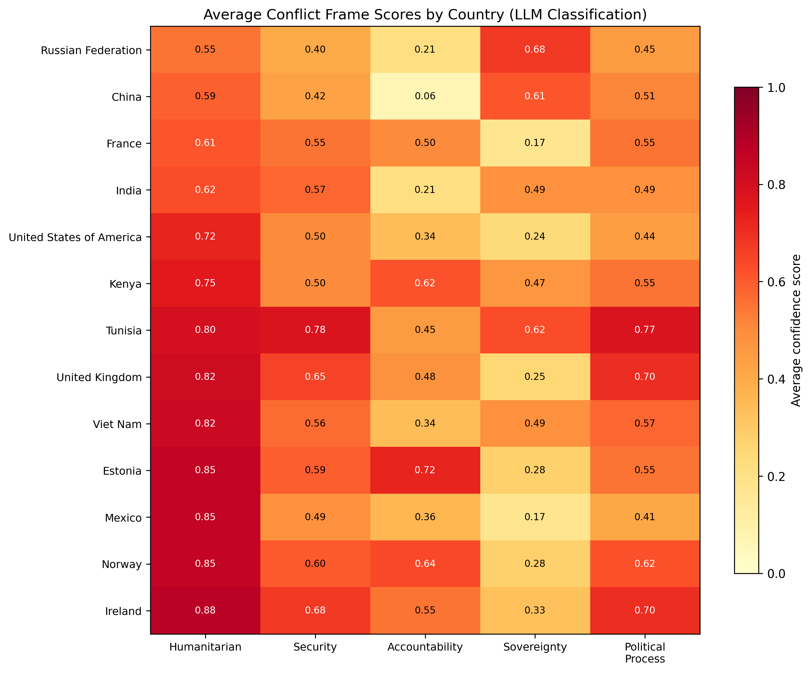
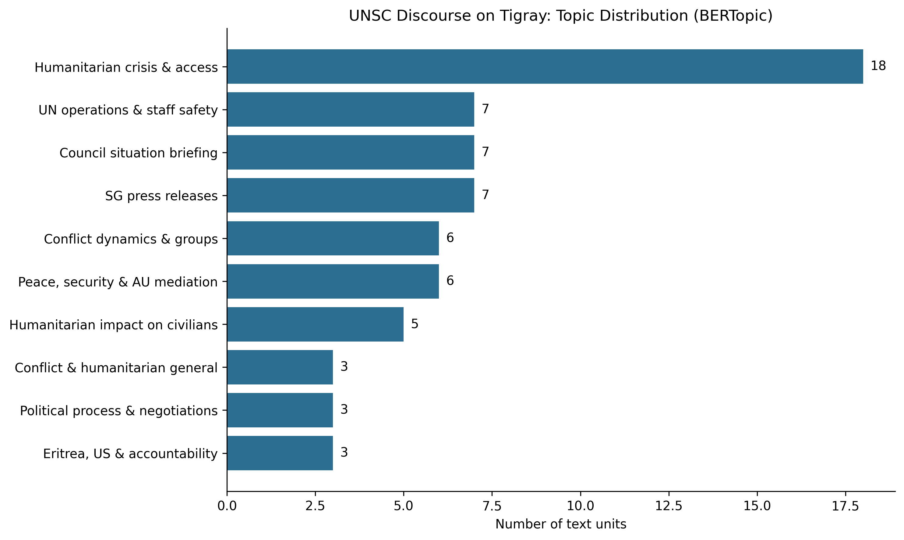
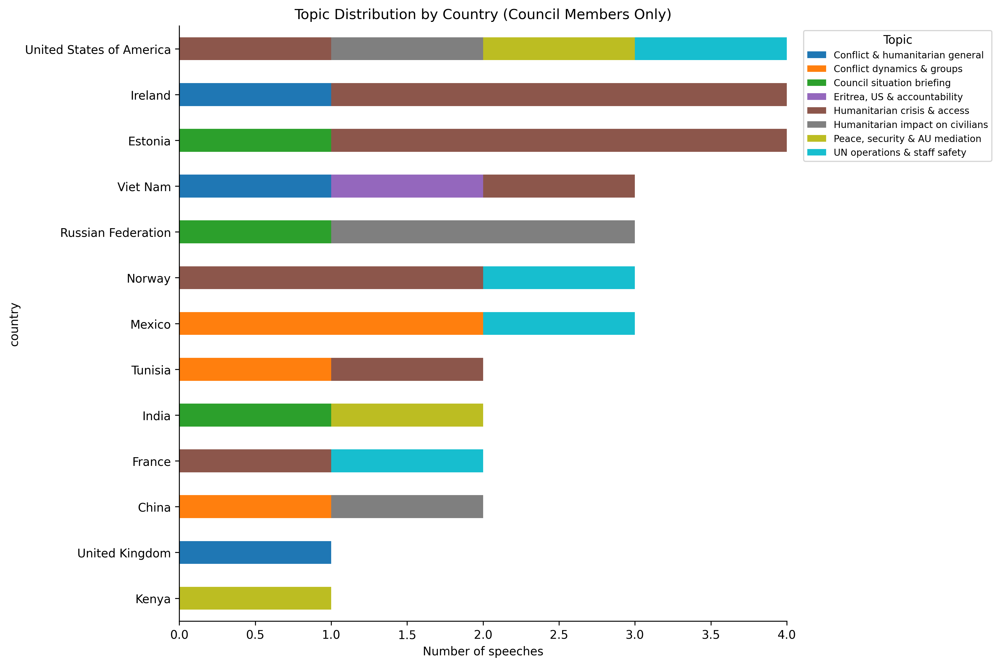
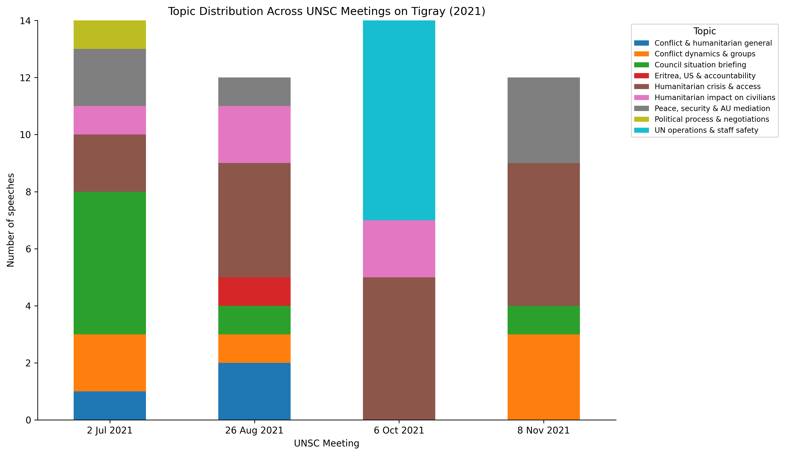
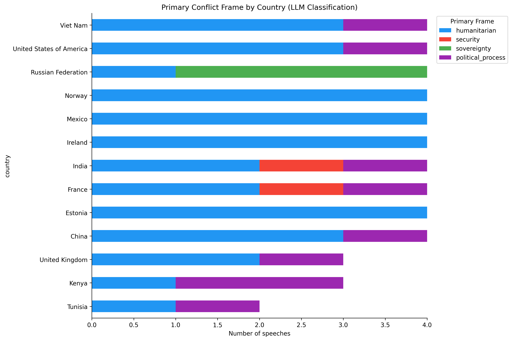
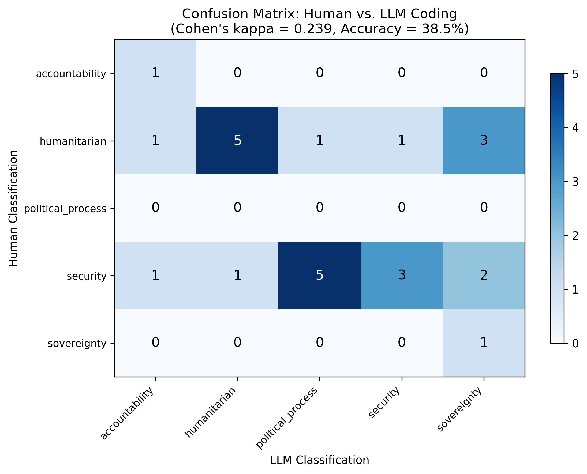

# LLM-Powered Conflict Text Analysis

## Research Question

How do UN Security Council member states frame the Tigray conflict, and how does framing vary across geopolitical blocs and over time (November 2020 to November 2022)?

## Navigation

| Section | Description |
|---------|-------------|
| [Motivation](#motivation) | Why text analysis matters for conflict research |
| [Key Findings](#key-findings) | Main results across both methods |
| [Data](#data-sources) | 88 text units from 18 UN documents |
| [Methods](#methods) | BERTopic, LLM-as-Annotator, Human Validation |
| [Results in Detail](#results-in-detail) | Figures and interpretation for each analytical step |
| [Limitations](#limitations) | Honest assessment of constraints |
| [Notebooks](#notebooks) | Four-notebook analytical progression |
| [How to Reproduce](#how-to-reproduce) | Setup and replication instructions |
| [References](#key-references) | Academic sources |

## Motivation

The UN Security Council discussed the Tigray conflict at least 15 times between November 2020 and November 2022, but geopolitical divisions prevented formal action. China and Russia repeatedly blocked resolutions, while Western members pushed for humanitarian access and accountability. The early meetings were held in closed format, producing no public record. Only four open meetings generated verbatim transcripts.

These transcripts contain the diplomatic language through which Council members framed the conflict. Different states emphasized different aspects: humanitarian crisis, military security, human rights accountability, state sovereignty, or political negotiation. Identifying these framing patterns systematically requires computational methods that go beyond manual reading.

This project applies two complementary approaches from the "Text as Data" tradition (Grimmer and Stewart, 2013): unsupervised topic discovery with BERTopic and theory-driven zero-shot classification with an LLM. The combination produces both data-driven and researcher-driven perspectives on the same corpus, and the disagreements between them are as informative as the agreements.

## Key Findings

**Humanitarian framing dominates Council discourse on Tigray.** BERTopic assigned 18 of 65 substantive documents to "Humanitarian crisis and access," the largest cluster. The LLM classified 53 of 88 texts with humanitarian as the primary frame. The average humanitarian confidence score across all Council member speeches was 0.66.

**Geopolitical blocs frame the conflict differently.** Russia (0.68) and China (0.61) scored highest on sovereignty. China scored lowest of all countries on accountability (0.06). Ireland (0.88), Norway (0.85), and Estonia (0.85) scored highest on humanitarian. Estonia (0.72) and Norway (0.64) also scored high on accountability.

**Framing shifted over time.** The July 2021 meeting had the most diverse topic mix. By October 2021, "UN operations and staff safety" dominated, corresponding to the killing of humanitarian workers. "Peace, security and AU mediation" grew across all four meetings as ceasefire pressure increased.

**BERTopic detects genre alongside theme.** A robustness check on speeches only (excluding press releases and letters) confirmed four substantive themes consistent with the full model, but also showed that the full model partly clusters by document type rather than purely by topic.

**Human-LLM agreement is fair but reveals systematic ambiguity.** Cohen's kappa was 0.239. The main disagreement: speeches blending ceasefire and military content were coded as "security" by the human and "political_process" by the LLM. This highlights genuine ambiguity in UNSC discourse.



## Data Sources

| Dataset | Source | Role |
|---------|--------|------|
| UNSC Verbatim Records (S/PV) | UN Digital Library | 4 open meeting transcripts parsed into 75 individual speeches |
| Secretary-General Press Releases | UN Digital Library | 10 official statements on key conflict developments |
| Security Council Press Statement | UN Digital Library | 1 collective Council position (SC/14501) |
| Letters from Eritrea | UN Digital Library | 2 formal responses to Council discussions |
| EHRC/OHCHR Joint Investigation Report | UN Digital Library | Reference document for validation (not in corpus) |

**Corpus dimensions:** 88 text units, 51,371 words, 33 unique speakers, 20 countries/entities.

| Document | Date | Type | Speeches Extracted |
|----------|------|------|--------------------|
| S/PV.8812 | 2 July 2021 | First open session on Tigray | 20 |
| S/PV.8843 | 26 August 2021 | Guterres briefed the Council | 17 |
| S/PV.8875 | 6 October 2021 | Open briefing | 18 |
| S/PV.8899 | 8 November 2021 | Major escalation phase | 20 |
| SG Press Releases | Feb 2021 - Nov 2022 | Secretary-General statements | 10 (whole documents) |
| Letters, Statement | Apr - May 2021 | Eritrea letters, SC statement | 3 (whole documents) |

## Methods

- **BERTopic** (Grootendorst, 2022): Unsupervised topic discovery using sentence transformer embeddings (all-MiniLM-L6-v2), UMAP dimensionality reduction, HDBSCAN clustering, and c-TF-IDF topic labeling. Parameters adjusted for small corpus: `n_neighbors=10`, `min_cluster_size=3`.

- **LLM-as-Annotator** (following Tornberg, 2025): Zero-shot classification using the Claude API (Haiku model). Each text receives confidence scores (0.0-1.0) for five predefined conflict frames: humanitarian, security, accountability, sovereignty, and political process. Frames are not mutually exclusive.

- **K-Means Robustness Check**: BERTopic re-run on the 75 speeches only (excluding press releases and letters) with k-means clustering (k=6) to test whether thematic structure holds within a single document type.

- **Human Validation**: Stratified random sample of 26 documents hand-coded by the researcher. Agreement measured with Cohen's kappa and confusion matrix.

## Results in Detail

### Corpus Construction

Text was extracted from 7 PDFs (using pdfplumber) and 11 Word documents (using python-docx). The four verbatim records were parsed into individual speeches using regex patterns matching speaker introductions (e.g., "Mr. Kimani (Kenya):"). Each speech was tagged with speaker name, country, date, and role (council member, briefer, president, invited state).

| Role | Text Units | Total Words |
|------|-----------|-------------|
| Council member | 48 | 33,307 |
| President | 18 | 4,522 |
| Secretary-General | 10 | 1,597 |
| Invited state (Ethiopia) | 5 | 5,312 |
| Briefer (UN officials) | 4 | 4,984 |
| Letter (Eritrea) | 2 | 1,315 |
| Council statement | 1 | 334 |

### BERTopic: Topic Distribution

BERTopic identified 12 topics (10 substantive, 2 procedural). After stopword removal and bigram extraction, the dominant topics were:

| Topic | Documents | Top Words |
|-------|-----------|-----------|
| Humanitarian crisis and access | 18 | humanitarian, tigray, ethiopia, people, conflict, access |
| SG press releases | 7 | secretary general, reiterates, statement issued |
| Council situation briefing | 7 | tigray, council, ceasefire, security |
| UN operations and staff safety | 7 | nations, united nations, staff, government |
| Peace, security and AU mediation | 6 | ethiopia, africa, peace, dialogue, african |
| Conflict dynamics and groups | 6 | mexico, ethiopia, group, conflict |
| Humanitarian impact on civilians | 5 | humanitarian, people, ethiopian |
| Eritrea, US and accountability | 3 | eritrea, united states, tplf, region |
| Political process and negotiations | 3 | process, parties, political |



### BERTopic: Topics by Country

Western states (Ireland, Estonia, Norway, US) produced the most speeches assigned to substantive topics. "Humanitarian crisis and access" appeared across most countries. India and Kenya leaned toward "Peace, security and AU mediation." Russia and China leaned toward "Humanitarian impact on civilians" and "Conflict dynamics" rather than accountability.



### BERTopic: Topics Over Time

The July 2021 meeting (first open session) had the most diverse topic mix. By October, "UN operations and staff safety" dominated. "Peace, security and AU mediation" grew across all four meetings.



### Robustness Check: Speeches Only

HDBSCAN on speeches only produced a single cluster (all 75 speeches share the same institutional register). K-means with k=6 recovered four substantive themes consistent with the full model:

| Theme | Speeches | Description |
|-------|----------|-------------|
| UN humanitarian operations | 21 | UN agencies, aid delivery, organizational response |
| Humanitarian crisis and civilians | 15 | Civilian suffering, government responsibility |
| Peace, security and AU mediation | 14 | Ceasefire, African Union, political dialogue |
| Conflict, human rights and accountability | 14 | Violations, human rights, conduct of parties |
| Procedural | 11 | Presidential transitions, agenda items |

### LLM Annotation: Primary Frame Distribution

The LLM classified 53 of 88 texts as primarily humanitarian, 16 as political process, 11 as sovereignty, 4 as security, and 3 as accountability.



### LLM Annotation: Frame Heatmap

The heatmap of average confidence scores across all five frames reveals the clearest geopolitical patterns:

| Country Group | Humanitarian | Accountability | Sovereignty |
|---|---|---|---|
| Ireland, Norway, Estonia | 0.85 - 0.88 | 0.55 - 0.72 | 0.28 - 0.33 |
| United Kingdom | 0.82 | 0.48 | 0.25 |
| United States | 0.72 | 0.34 | 0.24 |
| Kenya | 0.75 | 0.62 | 0.47 |
| Russia | 0.55 | 0.21 | 0.68 |
| China | 0.59 | 0.06 | 0.61 |

China's accountability score (0.06) is the lowest of any country on any frame, reflecting its consistent opposition to international human rights mechanisms. Kenya scored high on accountability (0.62) alongside humanitarian (0.75), a more nuanced position than the simple "regional solutions" narrative often attributed to African Council members.


### Validation: Human vs. LLM Agreement

Cohen's kappa: 0.239 (fair agreement). Overall accuracy: 38.5% (10/26 exact matches).

The confusion matrix shows two systematic disagreement patterns:

1. **Security vs. Political process**: 5 documents the human coded as "security" were classified as "political_process" by the LLM. These speeches discussed ceasefire alongside military dynamics.
2. **Humanitarian vs. Sovereignty**: 3 documents the human coded as "humanitarian" were classified as "sovereignty" by the LLM. These were speeches by China and Russia that discuss humanitarian conditions through a sovereignty lens.

The human coder concentrated labels in two categories (humanitarian: 12, security: 12), while the LLM distributed across all five. This distributional mismatch accounts for much of the low kappa.



## Limitations

1. **Small corpus.** 88 text units (75 speeches) from 4 meetings limits the statistical power of both BERTopic and cross-country comparisons. Most countries appear only 3-4 times.

2. **Closed meetings are missing.** The majority of Council discussions on Tigray were held in closed format ("any other business"), producing no public transcript. The open meetings represent a biased sample of Council discourse.

3. **BERTopic clusters partly by genre.** Press releases and letters cluster separately from speeches due to stylistic differences, not purely thematic ones. The speeches-only robustness check addresses this.

4. **Low human-LLM agreement.** Cohen's kappa of 0.239 indicates the LLM classifications should be interpreted cautiously. The security/political_process boundary needs clearer operationalization.

5. **Single human coder.** Validation with one coder cannot establish inter-coder reliability. A second independent coder would strengthen the validation.

6. **Frame overlap is inherent.** UNSC speeches routinely blend humanitarian, security, and political frames in a single statement. Forcing a primary label loses this complexity. The continuous confidence scores partially address this.

7. **PDF extraction introduces noise.** The two-column layout of UNSC verbatim records causes pdfplumber to occasionally merge text across columns. The speech parser handles most cases but some text fragments are imperfect.

## Project Structure

```
conflict-text-analysis/
├── data/
│   ├── raw/              # Original UN PDFs and DOCX files (not tracked)
│   └── processed/        # Cleaned corpus and annotations (not tracked)
├── notebooks/
│   ├── 01_data_collection.ipynb
│   ├── 02_bertopic_analysis.ipynb
│   ├── 03_llm_annotation.ipynb
│   └── 04_validation.ipynb
├── outputs/
│   └── figures/          # All visualizations
├── .env                  # API key (not tracked)
├── .gitignore
├── requirements.txt
└── README.md
```

## Notebooks

| Notebook | Description | Key Output |
|----------|-------------|------------|
| 01 Data Collection | Extract text from 18 UN documents, parse verbatim records into individual speeches | `corpus.csv`: 88 text units, 51,371 words |
| 02 BERTopic Analysis | Unsupervised topic modeling with full corpus and speeches-only robustness check | 12 topics (full), 6 topics (speeches-only k-means) |
| 03 LLM Annotation | Zero-shot classification via Claude API into 5 conflict frames | 53/88 humanitarian primary, geopolitical heatmap |
| 04 Validation | Hand-code 26 documents, compute agreement metrics | Cohen's kappa 0.239, systematic security/political disagreement |

## How to Reproduce

### Setup

```bash
conda create -n conflict-text python=3.11 -y
conda activate conflict-text
pip install -r requirements.txt
```

### Data

Download the following documents from the [UN Digital Library](https://digitallibrary.un.org) and place them in `data/raw/`:

| Document | Date |
|----------|------|
| S/PV.8812 | 2 July 2021 |
| S/PV.8843 | 26 August 2021 |
| S/PV.8875 | 6 October 2021 |
| S/PV.8899 | 8 November 2021 |
| S/2021/378 | 16 April 2021 |
| S/2021/510 | 27 May 2021 |
| SC/14501 | 22 April 2021 |
| SG/SM/20563 through SG/SM/21566 | Feb 2021 - Nov 2022 (10 press releases) |
| EHRC/OHCHR Joint Investigation Report | November 2021 (reference only) |

### API Key

For Notebook 03, create a `.env` file in the project root:

```
ANTHROPIC_API_KEY=your_key_here
```

Obtain an API key from [console.anthropic.com](https://console.anthropic.com). Estimated API cost for the full corpus: under $0.50.

### Run

Execute notebooks in order: 01, 02, 03, 04. Notebook 02 downloads the sentence transformer model on first run (~80 MB). Notebook 03 requires an active internet connection for API calls.

## Key References

- Grimmer, J. and Stewart, B.M. (2013). Text as Data: The Promise and Pitfalls of Automatic Content Analysis Methods for Political Texts. *Political Analysis*, 21(3), 267-297.
- Grootendorst, M. (2022). BERTopic: Neural Topic Modeling with a Class-Based TF-IDF Procedure.
- Maerz, S.F. and Puschmann, C. (2020). Text as Data for Conflict Research. In Deutschmann et al. (eds.), *Computational Conflict Research*. Springer.
- Tornberg, P. (2025). LLMs Outperform Expert Coders at Annotating Political Social Media Messages. *Social Science Computer Review*.
- Baumann, M. et al. (2025). LLM Hacking: Variability in LLM Classification. Working paper.
- Burnham, M. et al. (2025). Political DEBATE: Efficient Zero-Shot Classifiers for Political Text. *Political Analysis*.
- Alizadeh, M. et al. (2025). Open-Source LLMs for Text Annotation. *Journal of Computational Social Science*.

## Skills Demonstrated

Text extraction from PDFs and Word documents, corpus construction and speaker parsing, transformer-based topic modeling (BERTopic), LLM API usage for zero-shot classification, prompt engineering for structured JSON output, validation methodology with inter-annotator agreement metrics, temporal and cross-national framing analysis, robustness checking across model specifications.

## Portfolio Context

| Project | Topic | Status |
|---------|-------|--------|
| 1 | [Conflict Event Data Analysis and Geospatial Visualization](https://github.com/Sezibra/conflict-event-analysis) | Complete |
| 2 | **LLM-Powered Conflict Text Analysis** (this repo) | **Complete** |
| 3 | [Conflict Actor Network Analysis](https://github.com/Sezibra/conflict-network-analysis) | Complete |
| 4 | [Conflict Forecasting with Machine Learning](https://github.com/Sezibra/conflict-forecasting-ml) | Complete |
| 5 | [Causal Inference for Conflict with ML](https://github.com/Sezibra/conflict-causal-inference) | Complete |
| 6 | [Satellite Imagery for Conflict Damage Assessment](https://github.com/Sezibra/conflict-satellite-damage) | Complete |
| 7 | [Agent-Based Modeling for Conflict Dynamics](https://github.com/Sezibra/conflict-abm-simulation) | Complete |
| 8 | [Digital Trace Data Collection](https://github.com/Sezibra/conflict-data-collection) | Complete |
